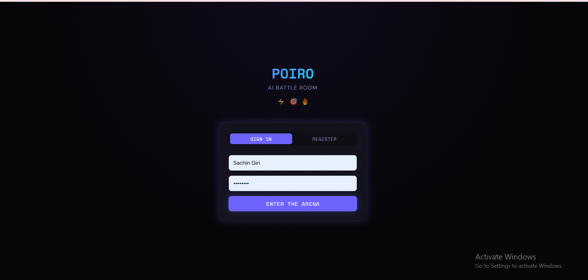
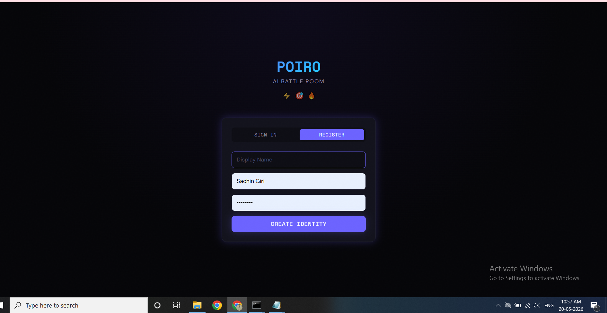

# Poiro — AI Battle Room

A real-time AI-powered creative challenge platform. Participants compete by submitting creative prompts, which get processed as async generation jobs. The host controls the room lifecycle and scores submissions.

---

## Quick Start
## Login Page



## Registration Page


## Dashboard


## Battle Room


### Prerequisites
- Python 3.11+
- Node.js 18+

### 1. Backend Setup

```bash
cd backend

# Copy env file
cp .env.example .env

# Install dependencies
pip install -r requirements.txt

# Start the server
uvicorn app.main:app --reload --port 8000
```

### 2. Frontend Setup

```bash
cd frontend

# Copy env file
cp .env.example .env.local

# Install dependencies
npm install

# Start the dev server
npm run dev
```

### 3. Open the App

Navigate to [http://localhost:3000](http://localhost:3000)

---

## Environment Variables

### Backend (`backend/.env`)

| Variable | Description | Default |
|----------|-------------|---------|
| `SECRET_KEY` | JWT signing secret | `poiro-secret-key-change-in-production` |
| `DB_PATH` | SQLite file path | `./poiro.db` |
| `ANTHROPIC_API_KEY` | Real AI generation (optional) | *(empty = mock)* |
| `USE_MOCK_AI` | Force mock AI provider | `false` |

### Frontend (`frontend/.env.local`)

| Variable | Description |
|----------|-------------|
| `NEXT_PUBLIC_API_URL` | Backend API URL |
| `NEXT_PUBLIC_WS_URL` | Backend WebSocket URL |

---

## Architecture

```
poiro-battle/
├── backend/
│   └── app/
│       ├── main.py              # FastAPI app + lifespan
│       ├── core/
│       │   ├── database.py      # SQLite init + connection
│       │   ├── auth.py          # JWT + password hashing (no deps)
│       │   ├── deps.py          # FastAPI auth dependencies
│       │   ├── ws_manager.py    # WebSocket connection manager
│       │   └── job_queue.py     # asyncio.Queue for jobs
│       ├── api/
│       │   ├── auth.py          # /api/auth routes
│       │   ├── rooms.py         # /api/rooms routes
│       │   ├── rounds.py        # /api/rounds routes
│       │   ├── submissions.py   # /api/submissions routes
│       │   └── ws.py            # /ws/room/{id} WebSocket
│       ├── services/
│       │   └── ai_provider.py   # AI abstraction (Anthropic or mock)
│       └── workers/
│           └── job_worker.py    # Async job processor
└── frontend/
    └── src/
        ├── app/
        │   ├── page.tsx         # Landing + auth + lobby
        │   └── room/[id]/page.tsx  # Battle room UI
        ├── store/
        │   ├── auth.ts          # Zustand auth state
        │   └── room.ts          # Zustand room state
        ├── hooks/
        │   └── useRoomWS.ts     # WebSocket hook with reconnect
        ├── lib/
        │   └── api.ts           # Type-safe API client
        └── types/
            └── index.ts         # Shared TypeScript types
```

---

## Database Schema

```
users            — id, email, password_hash, display_name, created_at
rooms            — id, code, title, host_id, status, created_at
room_participants — room_id, user_id, joined_at
rounds           — id, room_id, round_number, challenge, status, started_at, ended_at
submissions      — id, round_id, user_id, prompt, submitted_at
generation_jobs  — id, submission_id, status, output, error, created_at, started_at, completed_at
scores           — id, round_id, user_id, submission_id, points, eliminated, scored_at
room_events      — id, room_id, event_type, payload, created_at (audit log)
```

**Tradeoff — SQLite:** SQLite was chosen for simplicity and zero infrastructure. `WAL mode` is enabled for concurrent reads/writes. For production, this would need PostgreSQL for multi-process/multi-server deployments and proper connection pooling.

---

## Realtime Event Model

All events go over WebSocket at `/ws/room/{room_id}?token={jwt}`.

| Event Type | Direction | Payload |
|---|---|---|
| `participant_joined` | Server → All | `{user_id, display_name}` |
| `round_created` | Server → All | `{id, room_id, round_number, challenge, status}` |
| `round_started` | Server → All | `{round_id, round_number}` |
| `round_ended` | Server → All | `{round_id}` |
| `submission_received` | Server → All | `{submission_id, user_id, display_name, prompt, job_id, job_status}` |
| `job_update` | Server → All | `{job_id, submission_id, user_id, status, output?, error?}` |
| `score_updated` | Server → All | `{submission_id, user_id, points, eliminated}` |

---

## Generation Job Lifecycle

```
POST /api/submissions
        │
        ▼
  submission created
        │
        ▼
  generation_job INSERT (status=queued)
        │
        ▼
  asyncio.Queue.put(job_id)     ← non-blocking, returns immediately
        │
        ▼
  WS broadcast: submission_received (job_status=queued)
        │
        ▼
  [background worker picks up job]
        │
        ▼
  status=running → WS broadcast: job_update{running}
        │
        ▼
  ai_provider.generate_content()  ← 3-30s depending on provider
        │
        ├── success → status=completed, output saved → WS: job_update{completed, output}
        └── failure → status=failed, error saved   → WS: job_update{failed, error}
                            │
                            ▼
                    User can POST /api/submissions/{id}/retry
```

---

## Judging / Scoring Mechanism

**Chosen approach: Host-awarded points (0–100) + elimination flag.**

The host sees all completed submissions and manually awards points and can mark submissions as eliminated.

**Why:** A subjective creative competition is inherently hard to score algorithmically. Creativity is context-dependent. A human judge (the host) familiar with the challenge is better positioned than any automated system to evaluate novelty, fit, and execution.

**Weaknesses:**
- Fully subjective — bias is possible
- Doesn't scale to large rooms where host can't evaluate all entries
- No voting/consensus mechanism to counter host bias
- No time pressure on scoring

**Production improvements:**
- Peer voting: participants rate each other's work
- AI-assisted scoring with structured rubric (novelty 0-10, relevance 0-10, etc.)
- Blind voting (hide submitter identities)
- Time-boxed scoring phase
- Leaderboard across multiple rounds

---

## Failure Handling

| Failure | Behavior |
|---|---|
| AI generation fails | Job marked `failed`, error shown in UI, participant can retry |
| WebSocket disconnects | Client auto-reconnects every 2s with exponential backoff |
| Invalid/empty prompt | Rejected with 400 before job creation |
| Host tries to submit | Rejected with 403 on backend |
| Participant tries to control round | Rejected with 403 on backend |
| Duplicate submission per round | Rejected with 400 |
| Room code collision | Regenerated automatically |
| Page refresh | Auth from localStorage, room state rehydrated from API |

---

## What's Persisted

✅ Users and auth tokens  
✅ Rooms, codes, status  
✅ Participants  
✅ Rounds and their lifecycle  
✅ Submissions and prompts  
✅ Generation jobs and outputs  
✅ Scores and eliminations  

❌ WebSocket connections (ephemeral, reconnect on refresh)  
❌ In-progress generation state across server restarts  

---

## Role Enforcement

All role checks are performed on the **backend**, not just hidden in the UI:

- `rooms.py`: Only host can advance room status
- `rounds.py`: Only host can create/start/end rounds
- `submissions.py`: Host cannot submit; participant must be in room; one submission per round per user
- `submissions.py score`: Only host can score

---

## Known Limitations

1. **Single server only** — in-process asyncio queue won't work across multiple uvicorn workers. For multi-worker, replace with Redis + Celery/RQ.
2. **No WebSocket auth refresh** — if JWT expires during a session, the WS connection will fail silently.
3. **No media generation** — text-only output; no image/video pipeline.
4. **Mock AI is deterministic enough** — not randomized per user; could theoretically return same output to two users.
5. **No room cleanup** — rooms persist forever; no TTL or archival.
6. **Single round type** — only one active round per room at a time.

## What I'd Improve With More Time

- Redis for pub/sub and job queue (enables multi-worker deployment)
- PostgreSQL with proper migrations (Alembic)
- Refresh token rotation
- Real image generation (fal.ai / Replicate)
- Round timer with countdown
- Spectator mode
- Tournament bracket (multi-round elimination)
- Automated tests for critical paths (job lifecycle, permission enforcement)
- Docker Compose for one-command startup
